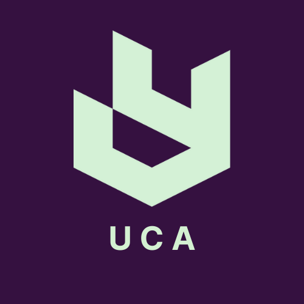

  
  
  <h1>United Club Association (UCA)</h1>
  
<b>The Official Digital Platform & Community Hub</b>

  
  

    <a href="https://unitedclubassociation.netlify.app"><strong>Visit the Live Website »</strong></a>
  

  

    
    
    
  

   

## 🌟 About UCA

The **United Club Association (UCA)** is a vibrant, national network of creators, thinkers, and student leaders based in Dhaka, Bangladesh. We bridge the gap between individual students, active school/college clubs, and corporate sponsors to foster growth, leadership, and community development.

This repository contains the official, production-ready codebase powering the UCA website.

---

## 🏗️ Architecture & Tech Stack

Our platform is built for speed, accessibility, and dynamic scalability, utilizing a modern serverless architecture.

| Component | Technology | Description |
| :--- | :--- | :--- |
| **Frontend Framework** | Vanilla HTML5, CSS3, JS (ES6+) | No heavy frameworks, ensuring lightning-fast load times. |
| **Styling** | Custom Modular CSS | CSS Variables for consistent theming (Starry Night Palette). |
| **Backend / API** | Netlify Serverless Functions | `Node.js` endpoints to handle dynamic requests. |
| **Database** | Neon Serverless PostgreSQL | Scalable cloud database using the `pg` module. |
| **Typography & Icons**| Embedded Fonts & Feather Icons| Custom iconography and web-safe performance. |
| **Hosting & CI/CD** | Netlify | Automated deployments and scalable edge delivery. |

---

## 📂 Directory Structure Overview

The codebase is organized modularly to separate concerns across styling, scripts, and static pages:

* 📁 **`/` (Root):** Core landing page (`index.html`), configuration files (`package.json`, `netlify.toml`), and SEO setups (`robots.txt`, `sitemap.xml`).
* 📁 **`/about/`:** Organizational information, including our history and the Executive Panel details.
* 📁 **`/clubs/`:** Individual sub-pages and portfolios for affiliated clubs (e.g., ULIC).
* 📁 **`/contact/`:** User engagement pages including the dynamic registration portal (`join-us.html`), FAQ, and general contact forms.
* ⚙️ **`/netlify/functions/`:** Serverless backend endpoints connecting our forms securely to the Neon database.
* 🎨 **`/css/` & `/clubs-css/`:** Modular stylesheets for global themes, components (navbar/footer), and specific pages.
* 📜 **`/js/` & `/clubs-js/`:** Component loaders and page-specific interactive logic.
* 🖼️ **`/images/` & `/cursors/`:** Static graphical assets, custom cursors, and organizational branding.

---

## 🚀 Key Features

* ✨ **Dynamic Registration Portal:** A multi-tab, strictly validated registration form handling Individuals, Affiliated Clubs, and Corporate Sponsors.
* ⚡ **Custom Serverless Integration:** Direct-to-database form processing using Netlify Functions, bypassing the need for a dedicated traditional backend server.
* 🧩 **Modular Component Loading:** Custom JavaScript functions to inject Navbars and Footers globally, keeping the HTML codebase DRY (Don't Repeat Yourself).
* 🌌 **Responsive & Immersive UI:** Features a deep-space aesthetic with custom interactive cursors tailored to different club categories.

 

  <i>Empowering the next generation of leaders.</i>

